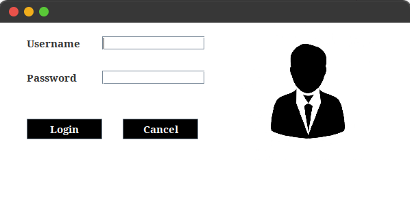
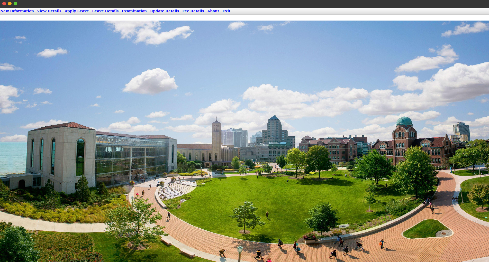

**University Management System**

The University Management System is a Java-based desktop application designed to streamline and automate various university management processes, such as managing students, faculties, and administrative tasks. This application provides a user-friendly interface for administrators, faculty members, and students to interact with the system.

**Features**

Student Management:

Add, update, view, and student records.
View student result marks and leave details.

Faculty Management:

Add, update, view, and faculty records.
leave details.

Administrative Tools:

Manage departments and university policies.

**Authentication:**

User roles: Admin, Faculty, Student.
Secure login system.
Technologies Used
Programming Language: Java
Database: MySQL (or any supported relational database)
User Interface: Java Swing
Development Environment: IntelliJ IDEA / Eclipse / NetBeans (select one or specify as per your project)
Prerequisites

Before you begin, ensure you have the following installed on your system:

Java Development Kit (JDK): Version 8 or higher.
MySQL: Version 5.7 or higher.
Maven: For dependency management and building the project.
IDE: IntelliJ IDEA / Eclipse / NetBeans.
Installation
Follow these steps to set up the University Management System on your local machine:

Step 1: Clone the Repository

Copy code: 

git clone https://github.com/muradmy00/University-Management-System/tree/main?tab=readme-ov-file

cd university-management-system

Step 2: Configure the Database

Open your MySQL server and create a new database:

sql

Copy code
CREATE DATABASE university_management;
Import the database schema and sample data:

Copy code

mysql -u root -p university_management < db/schema.sql

Update the database connection details in the src/main/resources/config.properties file:

properties

Copy code

db.url=jdbc:mysql://localhost:3306/university_management

db.username=root

db.password=yourpassword

Step 3: Build the Project

Use Maven to build the project:

Step 4: Run the Application
Run the application using your IDE or via the command line:

Copy code

java -jar target/university-management-system-1.0.jar

Usage

**Login Credentials**

Admin:
Username: murad
Password: 12345

**Application Screens**

Login Screen: Enter credentials to access the system.

**Login**

**Dashboard:**

Include screenshots of key screens, such as the login screen, admin dashboard, and course management page.

**Troubleshooting**

Common Issues

Database Connection Error:

Ensure MySQL is running and the credentials in config.properties are correct.

Build Failure:

Check Maven dependencies and ensure all are resolved.

UI Issues:

Ensure the application is run using the correct JDK version.
Contributing
Contributions are welcome! Please follow these steps:

**License**

This project is licensed under the MIT License.
